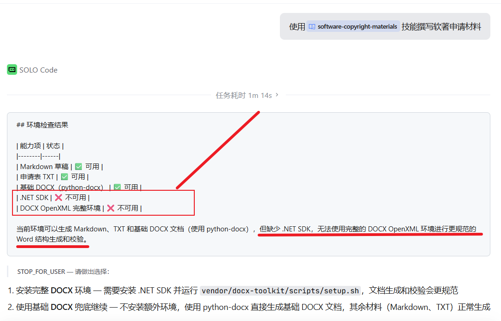
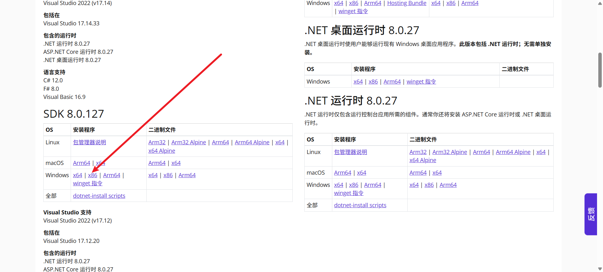
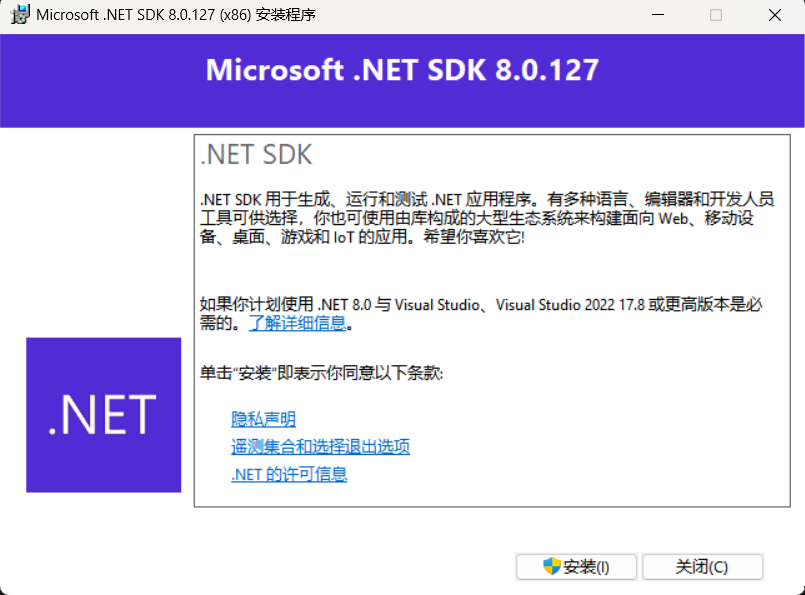
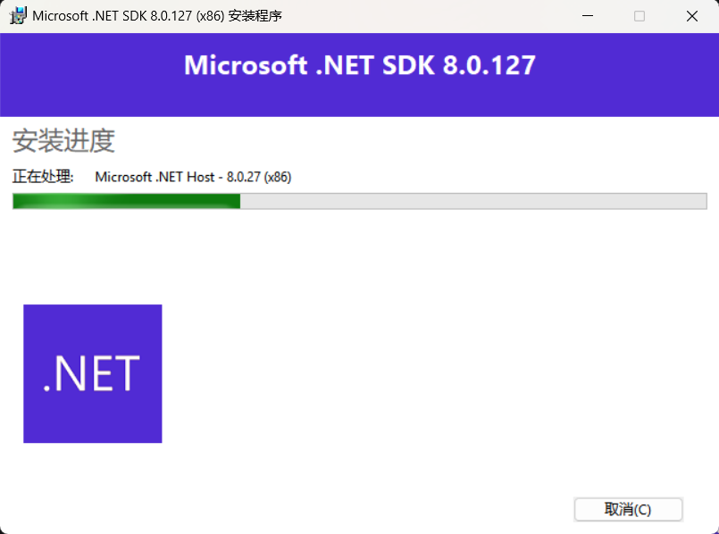
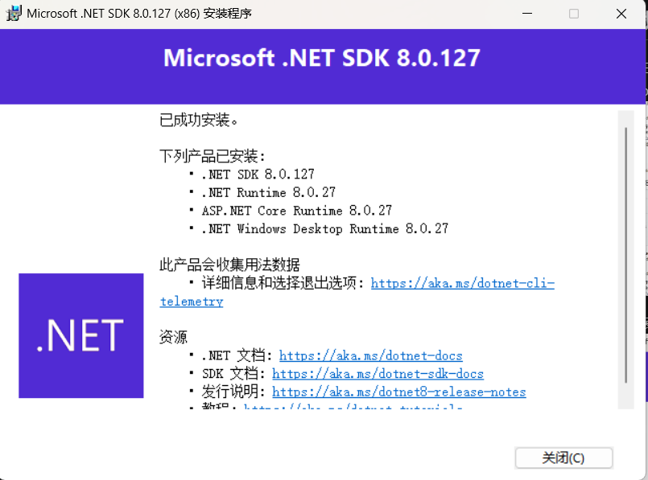
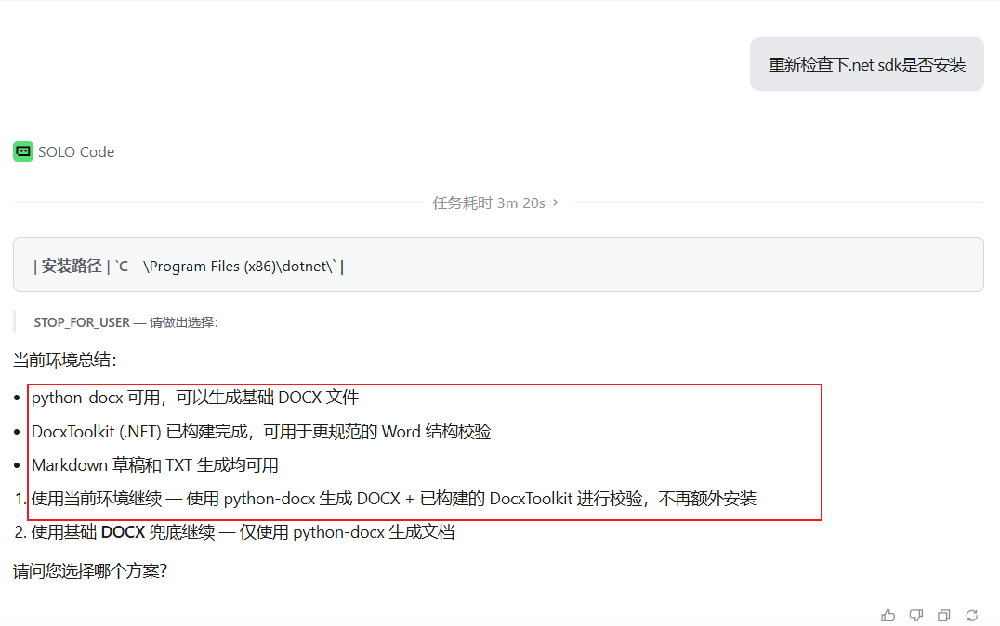

<!--
 * @Author: Whale-Yu 2933582448@qq.com
 * @Date: 2026-06-02 10:02:39
 * @LastEditors: Whale-Yu 2933582448@qq.com
 * @LastEditTime: 2026-06-02 12:17:33
 * @FilePath: \Tool_Clone_20260527_CopyrightMaterial-Skills\SoftwareCopyright-Skill\docs\Install_SDK_Tutorial_Win.md
 * @Description: 
 * 
 * Copyright (c) 2026 by 余俊瑜, All Rights Reserved. 
-->
# 安装 .NET SDK 8.0+ 教程（Windows）

## 0. 背景说明

在使用 Trae 生成材料时，环境检查提示缺少 .NET SDK，这将导致无法使用完整的 DOCX OpenXML 环境进行规范化的 Word 文档结构生成和校验。



> 说明：本文选择手动安装方式，而非 Trae 自动安装策略。

## 1. 官方下载与安装

### 1.1 下载安装包

访问 .NET 8.0 官方下载页面，下载 SDK 安装程序（SDK 包含运行时与编译工具）：[.NET 8.0 官方下载地址](https://dotnet.microsoft.com/zh-cn/download/dotnet/8.0)



### 1.2 执行安装

1. 双击下载的安装包
2. 按照安装向导提示，点击"安装"按钮
3. 等待安装完成





## 2. 验证安装是否成功

### 2.1 验证命令

安装完成后，**打开一个新的命令行终端**（CMD、PowerShell 或 Windows Terminal），执行以下命令：

```powershell
dotnet --version
```

如果输出显示 `8.0.x` 或更高版本（例如 `8.0.400`），则说明安装成功 🚀！

### 2.2 常见问题排查

如果出现以下错误提示：

**CMD 环境：**
```
C:\Windows\System32>dotnet --list-sdks
'dotnet' 不是内部或外部命令，也不是可运行的程序或批处理文件。
```

**PowerShell 环境：**
```
PS C:\WINDOWS\System32> dotnet --version
dotnet : 无法将"dotnet"项识别为 cmdlet、函数、脚本文件或可运行程序的名称。请检查名称的拼写，如果包括路径，请确保路径正确，然后再试一次。
所在位置 行:1 字符: 1
+ dotnet --version
+ ~~~~~~
+ CategoryInfo          : ObjectNotFound: (dotnet:String) [], CommandNotFoundException
+ FullyQualifiedErrorId : CommandNotFoundException
```

这通常是因为 .NET SDK 的安装路径未正确添加到系统环境变量中，或需要重启终端才能生效。请按以下步骤排查修复：

#### 步骤 1：确认安装路径

首先确认 .NET SDK 的实际安装位置。默认情况下，它应该安装在以下路径之一：
- `C:\Program Files\dotnet`
- `C:\Program Files (x86)\dotnet`

进入该目录，检查是否存在 `dotnet.exe` 文件以及 `sdk` 文件夹（其中应包含 `8.0.xxx` 子文件夹）。如果存在，说明安装本身没有问题，只是环境变量配置缺失。

#### 步骤 2：手动添加环境变量

1. 在 Windows 搜索框输入"环境变量"，选择"编辑系统环境变量"
2. 点击右下角的"环境变量"按钮
3. 在"系统变量"区域中找到名为 `Path` 的变量，双击打开
4. 检查是否已包含 `C:\Program Files\dotnet` 或 `C:\Program Files (x86)\dotnet`
5. 如果没有，点击"新建"并添加对应的路径
6. 连续点击"确定"保存并退出所有窗口

#### 步骤 3：重启终端验证

关闭当前终端，打开一个新的终端，再次执行：

```powershell
dotnet --version
```

## 3. 在 Trae 中重新检查环境

配置完成后，在 Trae 中重新检查环境，可以看到 .NET SDK 8.0+ 环境已正常！


