# 使用 TRAE SOLO 生成软著材料（国内友好版）

> 本文档将指导您使用 Trae Solo（国际版）结合 Software Copyright Materials Skill，实现从项目源代码到软件著作权申请材料（代码鉴别页、软件说明书等）的自动化生成，显著提升软著申报效率。

> 作者：[Whale-Yu](https://github.com/Whale-Yu)

> 最后更新：2026年6月2日

---

## 1. TRAE SOLO 安装与配置

### 1.1 下载与安装

1. 访问 Trae 官方下载页面：[https://www.trae.ai/](https://www.trae.ai/)
2. 下载对应操作系统的安装包
3. 按照安装向导提示完成安装

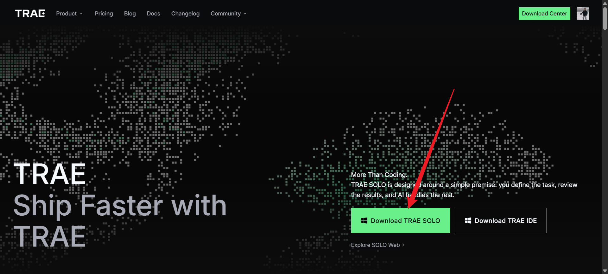

### 1.2 配置 API Key

首次使用需要添加并配置模型。本教程以 DeepSeek 为例，也可接入其他模型厂商。具体步骤如下：

#### 步骤 1：打开模型管理

1. 点击界面上的模型选择按钮
2. 点击"添加模型"

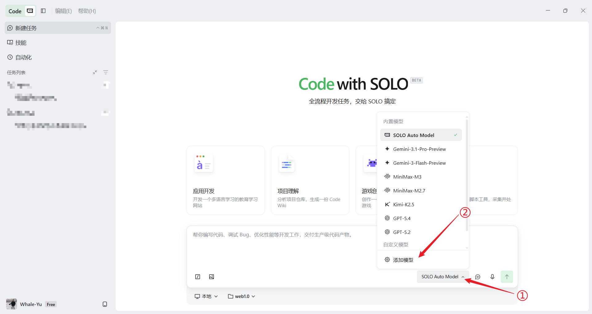

#### 步骤 2：添加新模型

点击"添加模型"按钮。

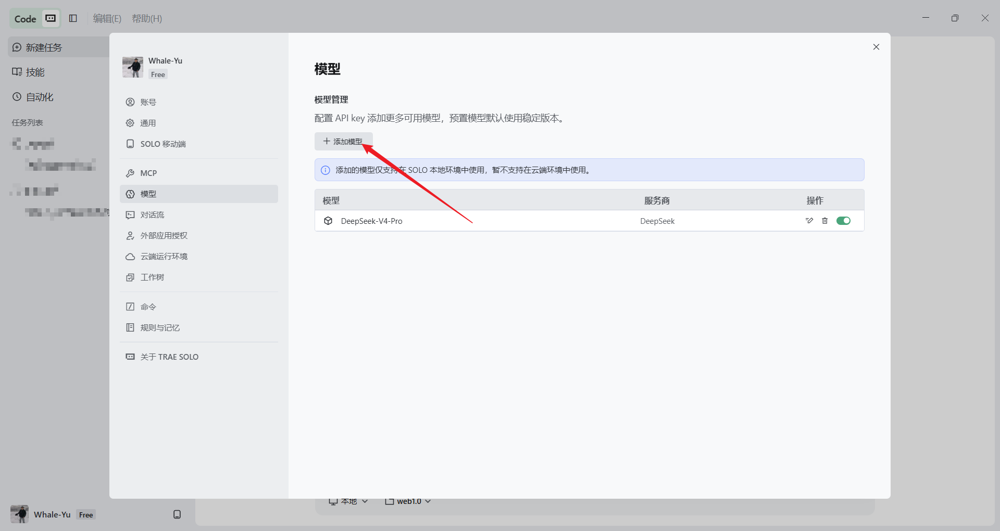

#### 步骤 3：配置模型参数

1. **选择模型厂商**：支持 OpenAI、Google Gemini、Anthropic Claude Code、DeepSeek 等众多厂商（本教程使用 DeepSeek 演示）
2. **选择具体模型**：例如 `deepseek-v4-pro` 或 `deepseek-v4-flash`
3. **填写 API 密钥**：在 [DeepSeek 平台](https://platform.deepseek.com/api_keys) 获取 API Key（DeepSeek Token 消耗相对较低）
4. **提交测试**：点击提交后会自动进行模型请求测试，如失败会有提示

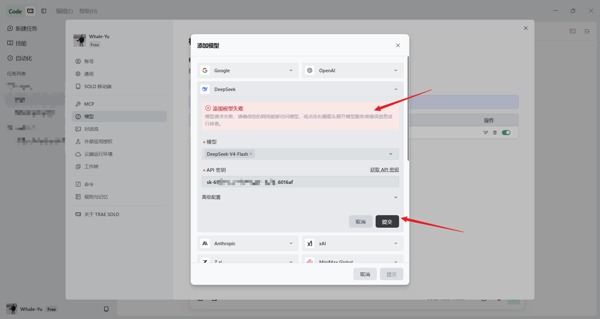

5. **完成配置**：确认测试通过后点击提交

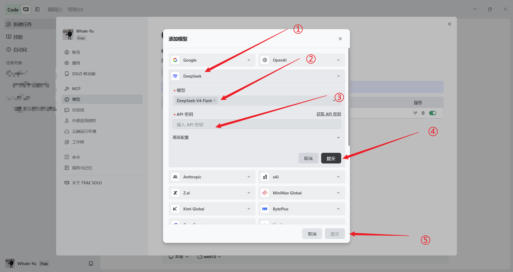
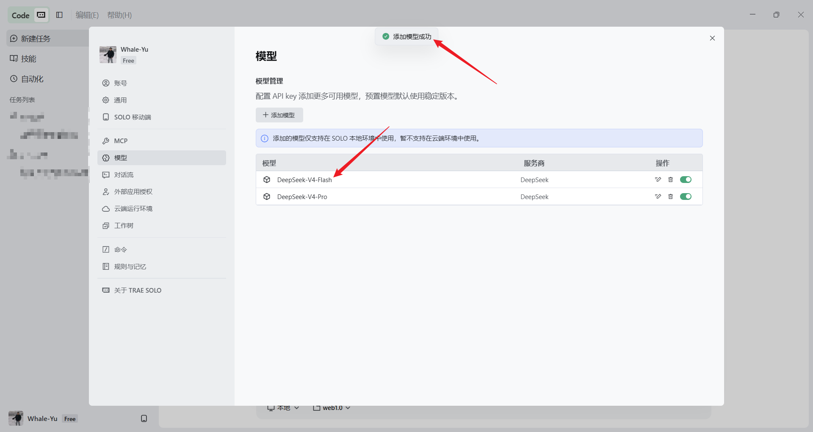

### 1.3 验证可用性

1. 返回对话页面
2. 选择刚才添加的模型
3. 发送测试消息，确认模型能够正常响应


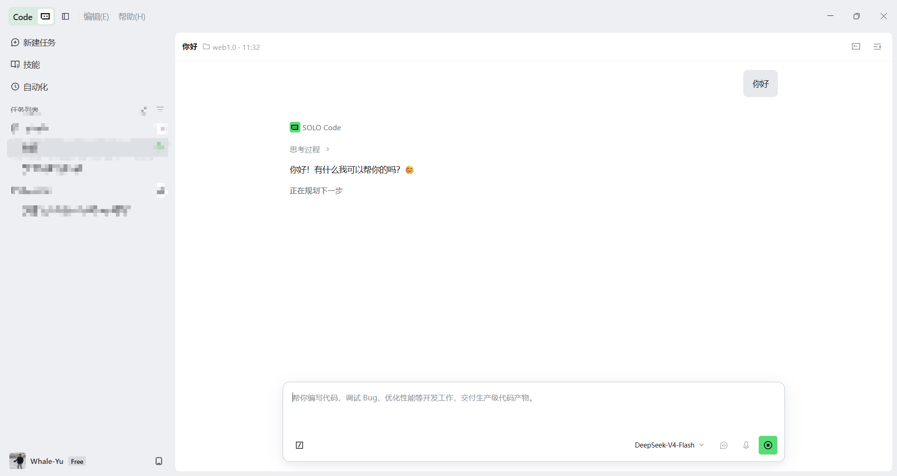

---

## 2. Skill 下载与安装

### 2.1 下载 Skill

1. 访问 GitHub Releases 页面下载最新版本的压缩包：[SoftwareCopyright-Skill Releases](https://github.com/Fokkyp/SoftwareCopyright-Skill/releases)
2. 建议将压缩包保存到固定位置（例如 `D:\software-copyright-materials-v1.0.0.zip`）

### 2.2 安装 Skill

1. 点击左侧边栏的"技能"按钮
2. 点击"上传技能"

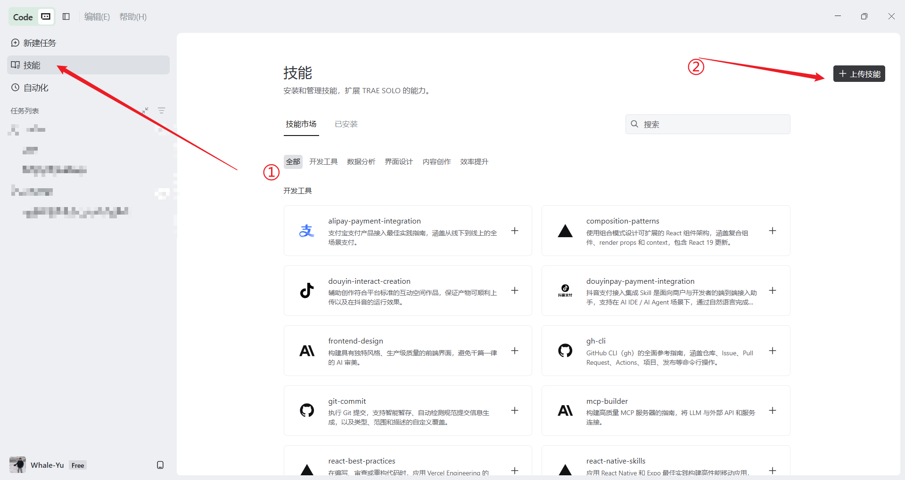

3. 点击"上传"按钮
4. 选择刚才下载的 Skill 压缩包
5. 点击"打开"确认上传

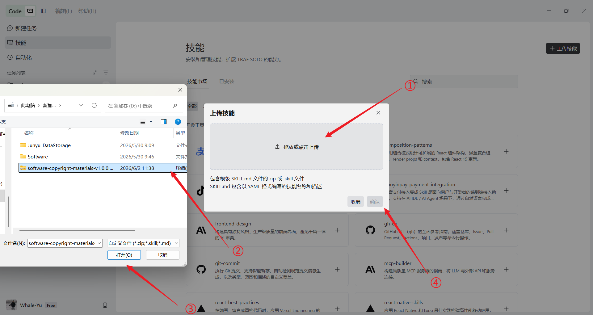

6. 安装完成！

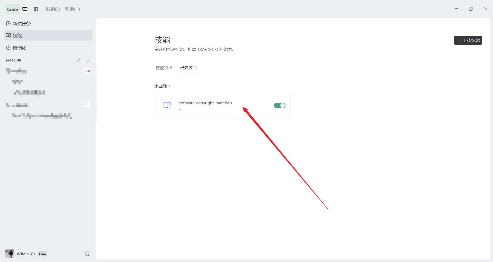

---

## 3. 开始生成材料

### 3.1 准备工作

1. 确保处于 **Code 模式**（左上角，不是 Work 模式）
2. 选择"本地"项目
3. 选择软件项目的根目录
4. 选择已配置好的模型

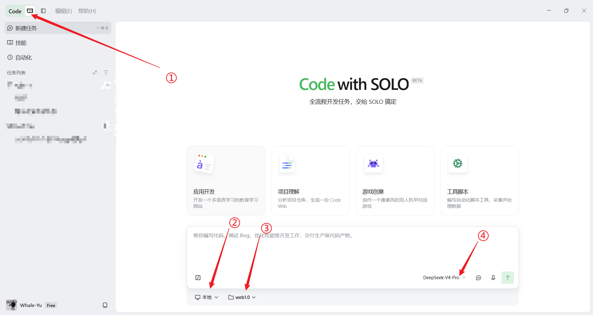

### 3.2 选择并使用 Skill

1. 选择已安装的 `software-copyright-materials` 技能

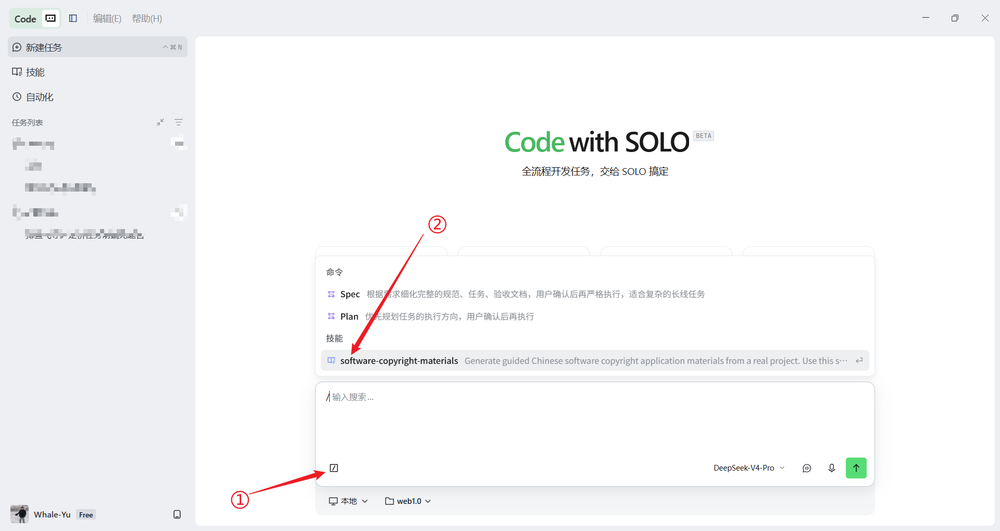

2. 在输入框中填写提示词：
   ```
   使用 software-copyright-materials 生成当前项目的软件著作权申请资料
   ```
3. 发送消息开始生成

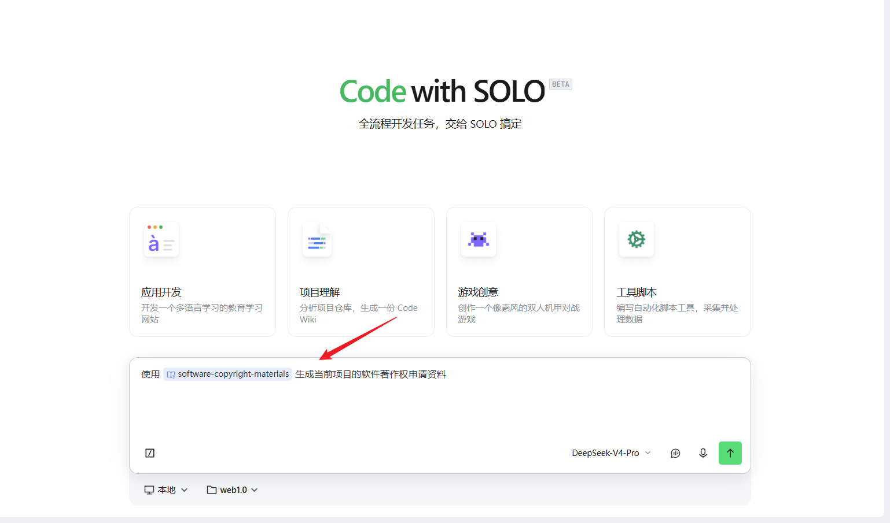

### 3.3 环境检查

等待环境检查完成...

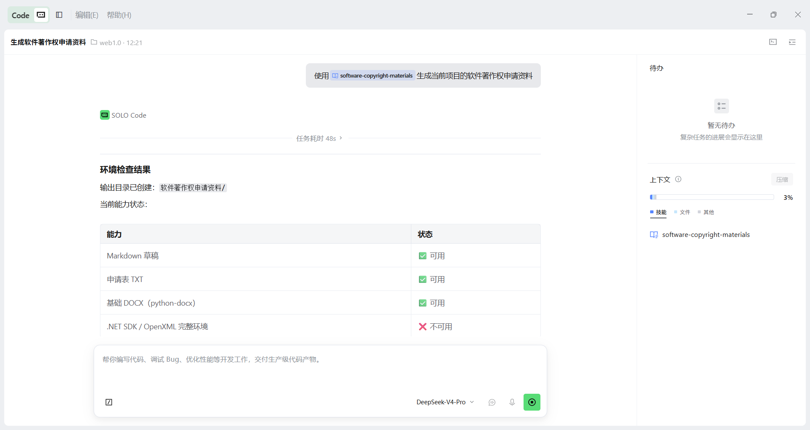

**常见环境问题处理：**

- **问题 1**：提示"缺少 .NET SDK，无法使用完整的 DOCX OpenXML 环境进行更规范的 Word 结构生成和校验"
  - 解决方案：参考 [安装 .NET SDK 8.0+ 教程（Windows）](Install_SDK_Tutorial_Win.md) 进行安装，也可跳过使用基础 DOCX 环境

- **问题 2**：提示".NET SDK 已确认可用，DocxToolkit 项目也已构建成功。但环境检测脚本依赖 bash 来验证完整 DOCX OpenXML 环境，而当前 Windows 系统上没有安装 bash"
  - 解决方案：安装 Git 或 WSL（推荐安装 Git，参考 [Git 安装教程](https://git-scm.com/book/zh/v2/%E8%B5%B7%E6%AD%A5-%E5%AE%89%E8%A3%85-Git)）

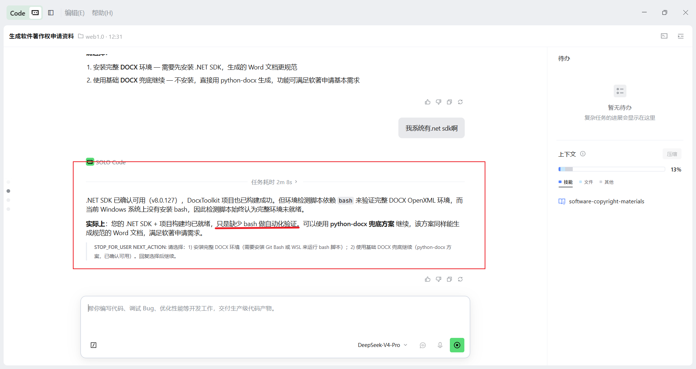

### 3.4 生成流程

环境检查通过后，按照提示一步步确认，将经过多轮任务自动生成所需材料。

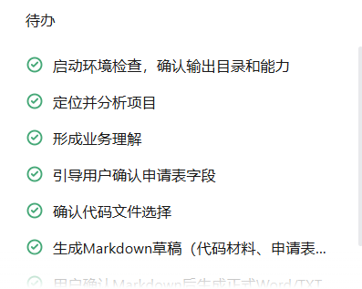

---

## 4. 查看生成结果

生成完成后，可以查看以下输出文件：

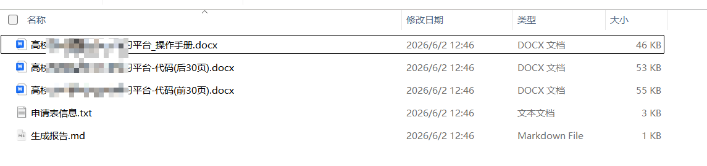
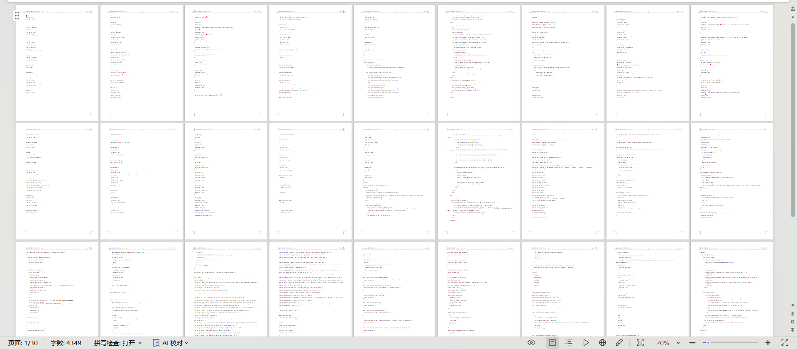
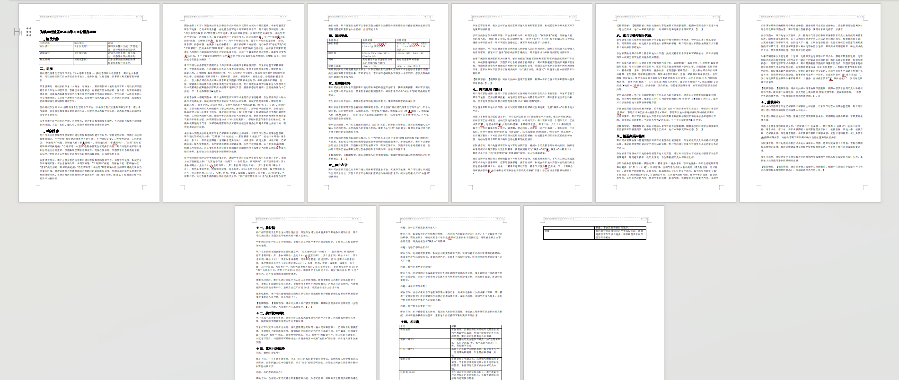

> 备注：操作手册中的截图位置已预留，请根据实际情况自行截图补全。

---

## 5. 结语

至此，利用 Trae Solo 自动生成软件著作权申请材料的完整流程已经结束。

通过本 Skill，可以将原本繁琐的代码整理、鉴别材料生成、软件说明书编写等工作自动化完成，大幅降低软著申报准备成本。

如在使用过程中遇到问题，欢迎前往项目仓库提交 Issue 或参与讨论，共同完善工具能力。

如果本项目对你有所帮助，欢迎点个 ⭐ Star 支持一下作者。

祝你软著申请顺利！